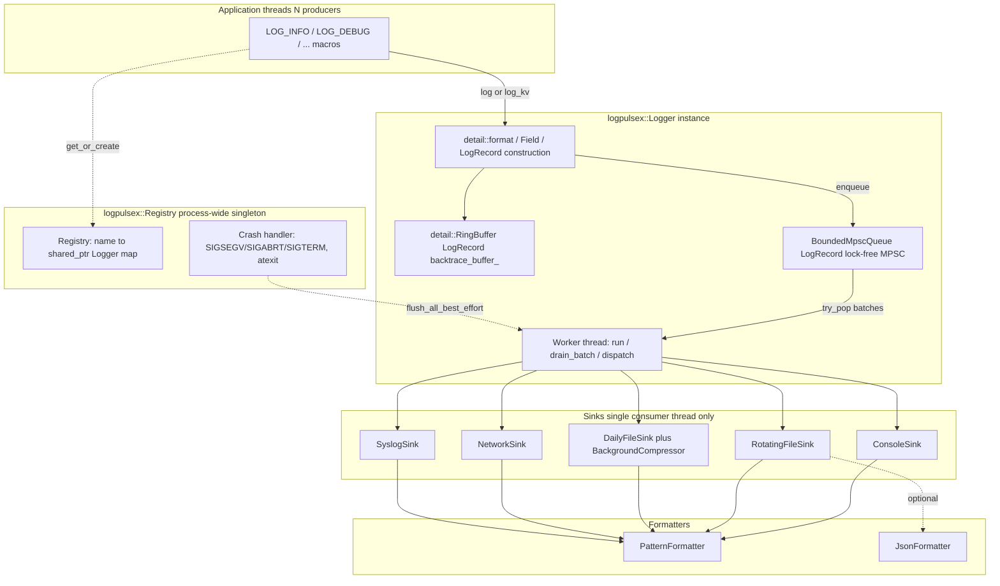
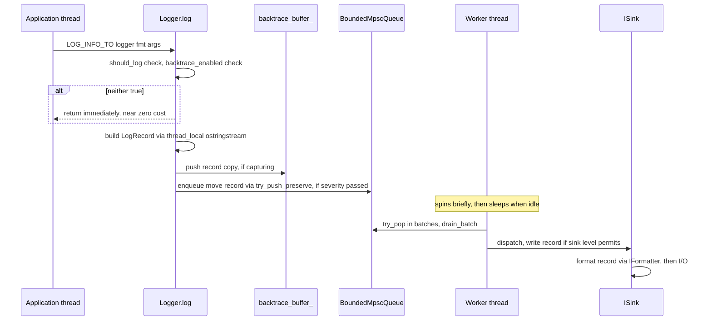
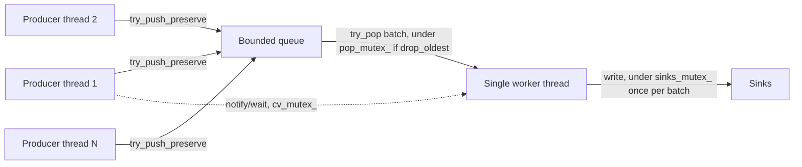

# LogPulseX
A small, header-only C++20 logging library: async, lock-free on the hot path, with console, size-based rotating file, daily rotating file, syslog, and TCP network sinks, structured (JSON) logging, and crash-safe flushing.

## Features — why LogPulseX over spdlog / glog / Boost.Log?

This is a design/safety comparison, not a throughput benchmark — spdlog
and Quill are mature, widely deployed, and competitive or faster on raw
messages/sec in published benchmarks. The differentiators below are
about what happens at the edges: injection safety, crash paths, and
resource bounds, which are easy to overlook until they matter in
production.

| Capability | LogPulseX | spdlog | glog | Boost.Log |
|---|---|---|---|---|
| Header-only, zero mandatory deps | ✅ | ✅ (header-only mode available) | ❌ (compiled lib) | ❌ (compiled lib) |
| Log-injection-safe by default (newline/control-char escaping, CWE-117) | ✅ always on | opt-in / manual | ❌ | ❌ |
| Type-safe `{}` formatting (no printf directives, CWE-134) | ✅ | ✅ | ❌ (printf-style `COMPACT_GOOGLE_LOG`) | partial |
| Bounded queue with explicit overflow policy (no unbounded memory growth) | ✅ `block`/`drop_newest`/`drop_oldest` | ✅ (async mode) | ❌ | ❌ |
| Crash handler with self-deadlock protection (reentrant-lock tracking) | ✅ | ❌ | ❌ | ❌ |
| Backtrace ring buffer (buffer verbose records, replay on error/crash) | ✅ | ✅ (`enable_backtrace`) | ❌ | ❌ |
| Native OS thread ID + `std::thread::id` both captured | ✅ | ❌ (one or the other) | ❌ | ❌ |
| Built-in hex/binary dump formatting with bounded output size | ✅ | ❌ | ❌ | ❌ |
| Structured key/value + JSON output built-in | ✅ | plugin/manual | ❌ | ✅ |
| Syslog / TCP network / size- and time-based rotating sinks built-in | ✅ | via extra sinks | partial | ✅ |
| Optional async gzip compression of rotated files (non-blocking, opt-in via zlib) | ✅ | ❌ (external tools only) | ❌ | partial (external) |
| Sink failures isolated (one broken sink can't silence others) | ✅ | partial | ❌ | partial |

**Where LogPulseX is deliberately conservative, not superior:** it doesn't
publish fixed benchmark numbers (hardware-dependent and easy to cherry-pick),
has a smaller sink/formatter ecosystem than spdlog, and (like spdlog) is not
strictly POSIX async-signal-safe end-to-end — see
[Crash and reliability design](#crash-and-reliability-design). A local
benchmark suite is included (see [Benchmarking](#benchmarking) below) so you
can measure against your own workload and hardware rather than trusting any
library's marketing.

## Quick start

```cpp
#include "logpulsex/logpulsex.hpp"

int main() {
    auto logger = logpulsex::default_logger();
    logger->add_sink(std::make_shared<logpulsex::ConsoleSink>());
    
    // Set compress_after_rotation=false if you don't need to use zlib.
    // true means you should have zlib library installed in your system. 
    auto daily_sink = std::make_shared<DailyFileSink>("app_daily.log",0,0,0,false);
    daily->set_level(Level::raw); // daily file gets more detail than console

    auto file_sink = std::make_shared<logpulsex::RotatingFileSink>(
        "app.log", /*max_bytes=*/10 * 1024 * 1024, /*max_files=*/5);
    file_sink->set_formatter(std::make_shared<logpulsex::JsonFormatter>());

    // Route verbose raw/hex-dump content to the file only -- both the
    // Logger's and this sink's own level need to permit Level::raw
    // independently (see the two-layer filtering note in level.hpp);
    // console is deliberately left untouched so dumps don't clutter it.
    file_sink->set_level(Level::raw);
    
    logger->add_sink(file_sink);
    logger->add_sink(daily_sink);

    logpulsex::install_crash_handlers();

    LOG_INFO("Server starting on port {}", 8080);
    LOG_ERROR("Failed to connect to {}: {}", "db-primary", "timeout");
}
```

Build:
```
mkdir build
cd build
cmake .. -DCMAKE_BUILD_TYPE=Release
cmake --build .
./logpulsex_example
ctest
```

Or without CMake:   
   **Note:** You need to supply this keyword if you want to use zlib file compression "-DLOGPULSEX_HAVE_ZLIB".   
Windows:
```
g++ -std=c++20 -O2 -Iinclude -pthread examples/main.cpp -o example
```
Mac:
```
g++ -std=c++20 -O2 -Iinclude -pthread examples/main.cpp -o example -lz
```

## Architecture

### Goals

| Goal | How it's achieved |
|---|---|
| Producer threads never stall on I/O | Lock-free bounded MPSC queue; a single dedicated worker thread does all sink I/O |
| Bounded memory under load | Fixed-capacity queue + fixed-capacity backtrace ring buffer — no unbounded growth (DoS resistance) |
| Header-only, zero mandatory deps | Everything in `include/logpulsex/*.hpp`; zlib/network are optional, gated by build flags |
| Safe by default | Log-injection-safe formatting, bounded resources, fail-fast validation, sinks isolated from each other's exceptions |
| Crash-safe best-effort flush | Reentrant-lock tracking + bounded `try_lock_for` so a crash handler can't self-deadlock or hang |
| Cross-platform (Win/Linux/macOS/Android/iOS) | `socket_compat.hpp`, platform-guarded includes in `log_record.hpp`, portable atomics/mutexes throughout |

### Component map



### Data flow (hot path)



Producers never perform sink I/O on this path, and the common case (queue
not full, worker already running) is lock-free — only atomics (queue
push/pop, level checks) and, if the message needs interpolation, a
`thread_local` scratch `ostringstream`. A producer takes a mutex only in
three bounded cases: waking an idle worker after a successful enqueue,
backpressure under `OverflowPolicy::block` (a bounded `wait_for`, never an
indefinite block), and serializing eviction under
`OverflowPolicy::drop_oldest` against the worker's own `try_pop()` — see
[Correctness bugs found via stress testing](#correctness-bugs-found-via-stress-testing)
for why that last one exists. A short lock-free spin before the worker
ever sleeps means bursty/tight-loop producers typically hit none of these.

### Core components

- **`LogRecord`** (`log_record.hpp`) — plain data struct carried through
  the whole pipeline: level, timestamp, `thread_id`/`native_thread_id`,
  process id, logger name, message, structured fields, file/line/function.
  Copyable/movable, no virtual dispatch.
- **`Logger`** (`logger.hpp`) — owns the config, the bounded queue, the
  sink list (guarded by a `std::timed_mutex`), the worker thread, and the
  backtrace ring buffer. Exposes `log()`/`log_kv()`, blocking `flush()`,
  crash-safe `flush_best_effort()`, and the backtrace API
  (`enable_backtrace`/`disable_backtrace`/`dump_backtrace`).
- **`Registry`** (`registry.hpp`) — process-wide singleton mapping logger
  name to `shared_ptr<Logger>`; owns crash-handler installation and the
  `default_logger()`/`get_logger()` convenience functions.
- **`BoundedMpscQueue`** (`spsc_mpsc_queue.hpp`) — Dmitry Vyukov's bounded
  MPMC ring buffer, used MPSC. Fixed power-of-two capacity, wait-free-ish
  `try_push`/`try_pop`, plus `try_push_preserve` (only moves from its
  argument once success is guaranteed, so a failed push never silently
  empties the caller's record); the single structure that makes
  "producers never block on I/O" and "bounded memory" both possible.
- **`ISink` implementations** (`sink.hpp`, `rotating_file_sink.hpp`,
  `daily_file_sink.hpp`, `network_sink.hpp`, `syslog_sink.hpp`) — each
  owns its own `Level` threshold independent of the logger's, and is only
  ever called from the single worker thread (no internal locking needed,
  `ConsoleSink` being the documented exception for shared-console use).
- **Formatters** (`formatter.hpp`) — `PatternFormatter` and
  `JsonFormatter`; both escape embedded newlines except `Level::raw` in
  `PatternFormatter` (see [`Level::raw` and why it's needed](#levelraw-and-why-its-needed)).
- **Backtrace ring buffer** (`backtrace_ring_buffer.hpp`) —
  `detail::RingBuffer<T>`: fixed-capacity, overwrite-oldest, captures
  every record independent of the severity filter so verbose context
  survives even at a quiet runtime level. `dump_backtrace()` replays
  through the normal `enqueue()` path, never writing to sinks directly.
- **Internal lock tracking** (`internal_lock.hpp`) — `thread_local`
  reentrancy depth counter shared by `Logger::sinks_mutex_`,
  `Registry::mutex_`, and the ring buffer's mutex; the backbone of the
  crash-safety design below.

### Concurrency model



Many application threads may log concurrently; exactly one worker thread
per `Logger` performs all dispatch/I/O. `sinks_mutex_` (a
`std::timed_mutex`) protects only the sink list itself (add/remove/
iterate/dispatch) and is locked once per drained batch, not once per
record. A separate `cv_mutex_` backs three condition variables
(`not_empty_cv_`/`not_full_cv_`/`drained_cv_`) used only as wake-up hints
with bounded `wait_for()` timeouts — the lock-free queue remains the
source of truth throughout, so a missed wakeup only costs latency, never
correctness. `pop_mutex_` is a fourth, narrower mutex used only under
`OverflowPolicy::drop_oldest` (see below).

### Correctness bugs found via stress testing

Two bugs surfaced only under sustained load with a real sink and a small
queue capacity — neither reproduced in small isolated repros:

- **`drop_oldest` livelock.** Producer-side eviction called
  `BoundedMpscQueue::try_pop()` directly, but that method is documented
  and implemented single-consumer-only (a non-atomic dequeue cursor) —
  the worker thread already calls it from `drain_batch()`. Two
  concurrent poppers corrupted the cursor and spun the process at 100%
  CPU indefinitely. Fixed with a dedicated `pop_mutex_` that serializes
  every `try_pop()` call, but only when `OverflowPolicy::drop_oldest` is
  configured — `block`/`drop_newest` (including the default policy) pay
  no extra cost.
- **Silent record corruption on retry.** `try_push(T item)` took its
  argument by value, so a failed push still move-constructed from the
  caller's record at the call site regardless of outcome — the first
  failed attempt silently emptied `message`/`logger_name`/`fields`, and
  every subsequent retry under `drop_oldest`/`block` then enqueued an
  already-empty record. Fixed with `try_push_preserve(T&)`, which only
  moves from the argument once success is guaranteed; `try_push(T)` now
  just delegates to it, so existing by-value callers are unaffected.

Both are covered by dedicated regression tests in `tests/test_main.cpp`
(`test_overflow_policy_drop_oldest_flush_completes`,
`test_enqueue_retry_does_not_corrupt_record_contents`, and others).

### Crash and reliability design

A synchronous fault (SIGSEGV, etc.) is delivered to the exact thread that
caused it. If that thread happens to be the worker thread, already
holding `sinks_mutex_` inside a sink's `write()`, a naive crash handler
that calls `flush()` again would self-deadlock (re-locking an
already-owned non-recursive mutex is undefined behavior). Fixed with
three layers:

1. **`std::timed_mutex`** everywhere a crash-path lock is taken, enabling
   bounded `try_lock_for()` instead of blocking indefinitely.
2. **Reentrancy tracking** (`internal_lock_depth()`) — conservatively
   records "this thread currently holds an internal lock" for a window
   that is always a superset of the true locked duration.
3. **`flush_best_effort()` / `flush_all_best_effort()`** — the
   crash-only path: bail out immediately if the current thread already
   holds the lock; otherwise try for a short bounded time (20–50ms) and
   give up cleanly rather than hang. The same bounded window also
   attempts a `backtrace_buffer_.try_snapshot()`, so a crash report can
   include the trace/debug history leading up to it.

This is documented as **best-effort**, not strict POSIX
async-signal-safety (sink I/O can still allocate) — a deliberate,
honestly-scoped guarantee rather than an overclaimed one.

See `include/logpulsex/` — each header is single-purpose and documents its
own design tradeoffs inline.

## Design decisions

- **Header-only.** Easiest to drop into an existing build; no separate
  compiled artifact to version-match. Trade-off: slightly longer compile
  times per translation unit, mitigated by keeping headers focused so you
  only pay for what you `#include`.
- **No printf-style format strings.** `LOG_INFO("{} {}", a, b)` uses
  variadic templates and `operator<<`, so arguments are type-checked at
  compile time and a message can never be misinterpreted as a format
  directive (CWE-134).
- **Bounded queue + explicit overflow policy.** Logging can never cause
  unbounded memory growth. You choose `block` (never lose a record, may
  apply backpressure to producers), `drop_newest`, or `drop_oldest` up
  front, matching your reliability requirements.
- **Single consumer thread.** Sinks and formatters don't need their own
  locking; the queue is the only concurrency-sensitive component, and it
  uses a well-known correct algorithm (Vyukov's bounded MPMC queue,
  restricted here to MPSC use) instead of a mutex.
- **Log-injection-safe formatting.** Message content is escaped before
  being written (control characters, quotes in JSON) so untrusted data
  logged by the application cannot forge additional log lines or break
  structured output (CWE-117).
- **Sink failures are isolated.** One sink throwing (disk full, socket
  closed) is caught and counted, never taking down the worker thread or
  silencing other sinks.
- **`LOGPULSEX_MIN_LEVEL` compile-time stripping.** Set via build flag to
  remove low-severity log statements — including their argument
  evaluation — entirely from release binaries.
- **Crash-safety is best-effort by design.** `install_crash_handlers()`
  flushes on SIGSEGV/SIGABRT/SIGTERM/exit via `flush_best_effort()`, which
  is reentrancy-aware (a thread-local lock-depth counter detects if the
  crashing thread already holds `sinks_mutex_`/`Registry::mutex_` and
  skips rather than self-deadlocking) and bounded (`std::timed_mutex` +
  `try_lock_for`, 20-50ms, instead of blocking indefinitely). This
  eliminates the deterministic self-deadlock/hang failure modes, but it
  is still not strictly POSIX async-signal-safe end-to-end (sink I/O can
  itself allocate or call non-async-signal-safe libc functions) —
  documented explicitly in `registry.hpp`/`logger.hpp` rather than
  overclaiming a guarantee the implementation can't fully back.

## Complex logging features

**Structured key/value logging** — attach fields instead of (or alongside)
free-text messages:
```cpp
LOG_INFO_KV("Order placed",
            logpulsex::field("order_id", std::string("A1234")),
            logpulsex::field("amount", 59.99));
```
Fields render as extra top-level keys in `JsonFormatter` output, and via a
`{fields}` token in `PatternFormatter` patterns.

**Containers and optionals** log directly, including nested containers:
```cpp
std::vector<int> scores{95, 88, 76};
std::map<std::string, int> inventory{{"widgets", 12}};
LOG_INFO("scores={} inventory={}", scores, inventory);
// scores=[95, 88, 76] inventory={widgets: 12}
```
Supported out of the box: `vector`, `array`, `deque`, `list`, `set`,
`unordered_set`, `map`, `unordered_map`, `pair`, `optional` — including
nested combinations (`vector<vector<int>>`, etc). See
`include/logpulsex/container_format.hpp`.

**Format specifiers**, a subset of the `{fmt}`/Python mini-language:
```cpp
LOG_INFO("pi ~= {:.2f}", 3.14159);   // pi ~= 3.14
LOG_INFO("{:#x}", 255);              // 0xff
LOG_INFO("{:05}", 7);                // 00007
LOG_INFO("{:>10}|{:<10}|{:^10}", a, b, c); // right/left/center align
LOG_INFO("literal {{}} braces", 1);  // literal {} braces 1
```
Supported: width, zero-padding, precision, `f`/`e`/`x`/`X`/`o` presentation
types, `<`/`>`/`^` alignment, `+` sign, `#` alt-form, and `{{`/`}}` literal
brace escaping. See `parse_spec`/`apply_value` in `format.hpp`.

**Conditional and rate-limited logging** (glog-style):
```cpp
LOG_IF(logpulsex::Level::warn, queue_depth > 1000, "Queue backed up: {}", queue_depth);
LOG_EVERY_N(logpulsex::Level::info, 100, "Processed {} so far", count);      // 1st, 101st, 201st...
LOG_IF_EVERY_N(logpulsex::Level::warn, retry_failed, 10, "Retry #{}", n);    // every 10th time retry_failed is true
LOG_FIRST_N(logpulsex::Level::warn, 5, "Deprecated API called: {}", name);   // only the first 5 times
LOG_EVERY_T(logpulsex::Level::info, 1.0, "Heartbeat, tick={}", tick);        // at most once per second
```
These use a function-local static counter (or, for `LOG_EVERY_T`, a
dedicated `EveryTGate`) tied to the call site, so they must be used
inside a function body (not at namespace scope). Both are atomic and
safe to hit from multiple threads concurrently — verified under
ThreadSanitizer with 8 threads sharing one call site (exact occurrence
that fires may shift by one under heavy contention, by design, in
exchange for not taking a lock on every call).


**Daily rotating file sink** — rotates once per day at a configured local
time instead of by size:
```cpp
auto daily = std::make_shared<logpulsex::DailyFileSink>(
    "app.log", /*rotation_hour=*/0, /*rotation_minute=*/0, /*max_files=*/14);
logger->add_sink(daily);
// writes to app_2026-07-20.log, then app_2026-07-21.log after midnight, etc.
```
`max_files` (optional, default 0 = keep forever) prunes the oldest daily
files once the limit is exceeded. The rotation clock is injectable
(`DailyFileSink::Clock`) specifically so tests can simulate crossing a
midnight boundary deterministically instead of waiting on the real clock
— see `test_daily_file_sink_actually_rotates_at_boundary` in the test
suite for exactly how.

**Syslog sink** — sends records to the local syslog daemon / journald
(POSIX only; compiles to a documented no-op on Windows):
```cpp
#include "logpulsex/syslog_sink.hpp"
auto sl = std::make_shared<logpulsex::SyslogSink>("myapp", LOG_USER);
logger->add_sink(sl);
```
Log levels map to syslog priorities (`trace`/`debug`→`LOG_DEBUG`,
`info`→`LOG_INFO`, `warn`→`LOG_WARNING`, `error`→`LOG_ERR`,
`fatal`→`LOG_CRIT`). Message content is always passed as the *argument*
to a literal `"%s"` format string, never as the format string itself, so
log content containing `%` conversion specifiers can't be misinterpreted
by `syslog()` (CWE-134) — verified with an explicit `%n`/`%s`-payload
test. Note: `<syslog.h>` defines plain-integer `LOG_INFO`/`LOG_DEBUG`
macros that collide with this library's own `LOG_INFO(...)`/`LOG_DEBUG(...)`
macros; `syslog_sink.hpp` neutralizes this automatically (captures the
values it needs, then `#undef`s the colliding names) so the library's
logging macros always win regardless of include order — you don't need
to do anything, but it's worth knowing if you ever see `LOG_INFO`/`LOG_DEBUG`
referenced as bare integers elsewhere in your codebase after including
this header.

**Network sink** — ships formatted lines to a remote TCP log collector:
```cpp
#include "logpulsex/network_sink.hpp"
auto net = std::make_shared<logpulsex::NetworkSink>(
    "logs.internal.example.com", 5140,
    /*max_buffered_lines=*/1000, /*connect_timeout_ms=*/200, /*send_timeout_ms=*/100);
logger->add_sink(net);
```
Built for a flaky network by design: connect/send never block longer than
the configured timeouts (non-blocking sockets + `select()`), a failed
send buffers the line locally instead of losing it, and the local backlog
is bounded (`max_buffered_lines`) so a sustained outage can't grow memory
without limit — oldest buffered lines drop first. Reconnection is
lazy: the next `write()` or `flush()` after an outage retries the
connection and drains anything backlogged. Verified against a real local
TCP server across 5 scenarios: normal delivery, no server listening
(must not block), bounded backlog under sustained outage, reconnect +
backlog drain after the server comes back up, and sink-failure isolation
inside a `Logger` with another sink attached. Plaintext, no TLS — treat
as trusted-network-only (see security note in `network_sink.hpp`) unless
tunneled.

## Binary and hex dump logging

Two complementary tools for logging raw bytes, in `hex.hpp`.

**Inline command/response formatting** with `hex_bytes()` — for short
byte sequences (device protocol traces, command/response pairs), works
with any normal log level via the existing `{}` message formatting:
```cpp
std::uint8_t tx[] = {0xA1, 0xB2};
std::uint8_t rx[] = {0x00, 0xFF};
LOG_DEBUG("TX: {}", logpulsex::hex_bytes(tx, sizeof(tx))); // "TX: 0xA1 0xB2"
LOG_DEBUG("RX: {}", logpulsex::hex_bytes(rx, sizeof(rx))); // "RX: 0x00 0xFF"
```
Truncates to 256 bytes by default (pass a larger `max_bytes` explicitly
if needed) so a large or attacker-influenced buffer can't produce an
unbounded log line.

**Multi-row hex dumps** with `format_hex_dump()` + `LOG_RAW` — for
larger raw buffers, produces a classic offset/hex/ASCII layout:
```cpp
LOG_RAW("Device payload ({} bytes):\n{}", size, logpulsex::format_hex_dump(buf, size));
// 00000000  41 42 43 44 45 46 47 48 49 4A 4B 4C 4D 4E 4F 50  |ABCDEFGHIJKLMNOP|
// 00000010  51 52 53 54                                      |QRST|
```

### `Level::raw` and why it's needed

Every other level's plain-text rendering escapes embedded `\n` bytes in
the message (see the log-injection notes elsewhere in this file) — by
design, so untrusted text can't forge extra log lines. That's exactly
wrong for a hex dump, which *wants* real line breaks for its layout. A
new level, `Level::raw`, is the one exception: `PatternFormatter`/console
output renders `Level::raw` messages verbatim, preserving real newlines.

This is safe specifically because `format_hex_dump()`'s output can, by
construction, only ever contain hex digits, fixed layout characters, and
ASCII-sidebar text already filtered through a printable-character check
(which excludes the newline byte and every other control character) —
the *only* `\n` characters it can produce are the row separators the
function inserts itself, never one derived from the input buffer. Using
`LOG_RAW` with arbitrary untrusted text instead of this library's own
hex-dump output forfeits that guarantee — it's a deliberate, narrow
escape hatch, not a blanket exemption, and the caller takes on
responsibility for what they pass.

`JsonFormatter` is **not** affected by any of this — it always escapes
embedded newlines regardless of level, since a raw newline in a JSON
string value would produce invalid JSON. Instead, raw-level JSON records
carry `"level":"RAW"`, which is the signal a downstream viewer tool can
use to re-expand the escaped `\n` sequences back into real line breaks
when rendering — full JSON validity is preserved, and the multi-line
intent survives as metadata rather than as literal structure.

### Two gotchas worth knowing

1. **`raw` sits below `trace`** (most verbose tier, filtered out by any
   default threshold), so `LOG_RAW` calls are silently suppressed unless
   you explicitly opt in with `logger->set_level(Level::raw)`.
2. **Both the `Logger`'s level and each `Sink`'s own level are
   independent filters** — both must permit `Level::raw` for a raw
   record to reach a particular sink. Easy to forget: opening up the
   logger alone is not enough if a sink's own level (which defaults to
   `trace`) hasn't also been lowered. This is pre-existing, correct
   two-layer filtering behavior (lets you route verbose raw dumps to one
   sink, e.g. a file, without cluttering another, e.g. the console) —
   just unusually easy to trip over with `raw` specifically, since it
   sits below every other level. See `examples/main.cpp` for the
   intended pattern: route dumps to a dedicated sink, leave others
   untouched.

**Compatibility note:** adding `Level::raw` below `trace` shifted every
existing level's numeric value up by one. This only matters if your
build sets `LOGPULSEX_MIN_LEVEL` to a specific *integer* rather than
referencing level names in code — re-check any hardcoded numeric
threshold after upgrading; see the full note on `Level` in `level.hpp`.

## Benchmarking

A small, dependency-free benchmark suite lives under `bench/`. It's off
by default — enable it explicitly and build in Release mode (the Debug
CMake config enables `-fsanitize=address,undefined`, which badly skews
timings):

```
mkdir build && cd build
cmake .. -DCMAKE_BUILD_TYPE=Release -DLOGPULSEX_BUILD_BENCHMARKS=ON
cmake --build . --target logpulsex_bench
./logpulsex_bench
```

Or without CMake:
```
g++ -std=c++20 -O2 -Iinclude -Ibench -pthread bench/bench_main.cpp \
    bench/micro_bench.cpp bench/throughput_bench.cpp \
    bench/multithread_bench.cpp bench/sink_io_bench.cpp -o logpulsex_bench
./logpulsex_bench
```

What each suite measures:

| Suite | What it measures |
|---|---|
| `micro` | `detail::format()` cost per arg shape, `BoundedMpscQueue` push/pop round trip, `PatternFormatter`/`JsonFormatter` render cost |
| `throughput` | Single-thread `Logger::log()` call latency (percentiles) against a no-op sink, plus sustained producer rate and queue drain time |
| `multithread` | The same producer workload run with 1/2/4/8 concurrent threads sharing one `Logger`, reporting aggregate throughput and scaling efficiency vs. the 1-thread baseline |
| `sink_io` | Real `RotatingFileSink` throughput with `PatternFormatter` vs. `JsonFormatter`, writing to disk |

`--iterations` sets the sample count for every suite (micro-benchmark
iterations, throughput latency samples, msgs/thread for `multithread`,
and msg count for `sink_io`) — it defaults to 1,000,000. Results can be
exported as CSV and/or a Markdown table (the latter pastes directly into
a README or PR description):
```
./logpulsex_bench --suite=micro,throughput,multithread,sink_io \
                   --iterations=1000000 --duration=SECONDS --threads=1,2,4,8 \
                   --csv=results.csv --markdown=results.md
```

Results are hardware- and configuration-dependent (queue capacity,
overflow policy, formatter, sink type, thread count), so no fixed numbers
are published here — run it on your own target hardware and workload
shape instead.

**A known trade-off, found by benchmarking the perf round above, not
just testing it:** the condvar-based worker wake-up in
[Concurrency model](#concurrency-model) improved real
`RotatingFileSink` throughput and multithread scaling shape, but a
before/after comparison against the prior `sleep_for`-based worker loop
showed pure in-memory, `NullSink`-backed, single/low-thread throughput
is measurably lower than the old design (a bounded lock-free spin before
the worker sleeps recovered most, not all, of the gap). Passing
correctness/stress tests after a concurrency change is not evidence a
performance change helped — always re-run `bench/` before and after.